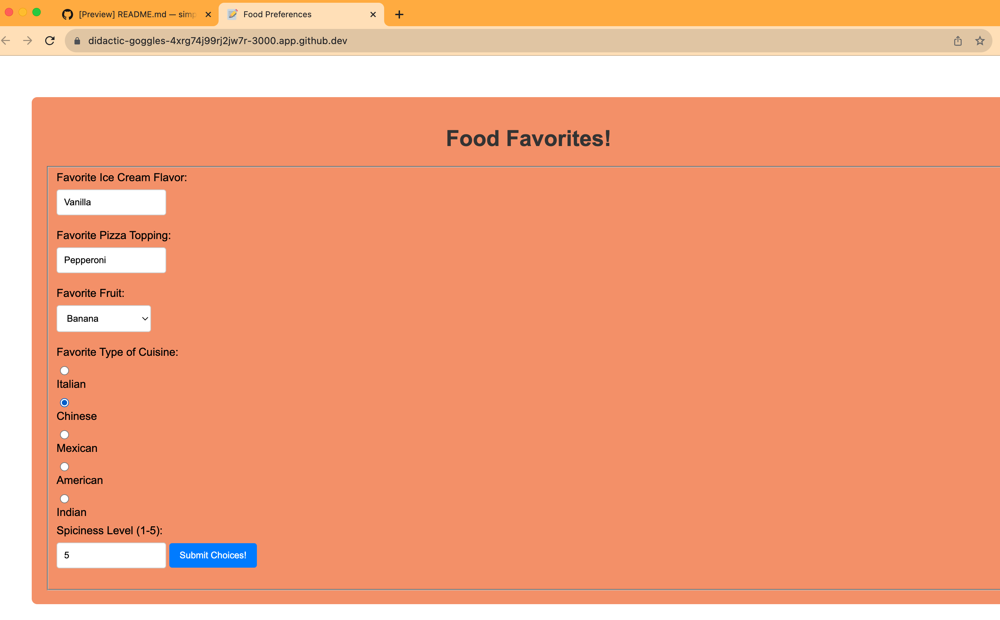
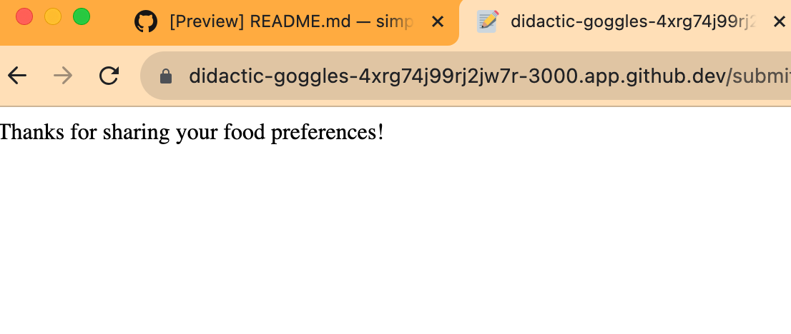
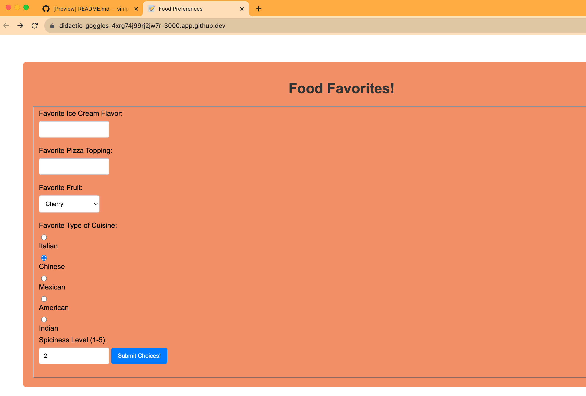
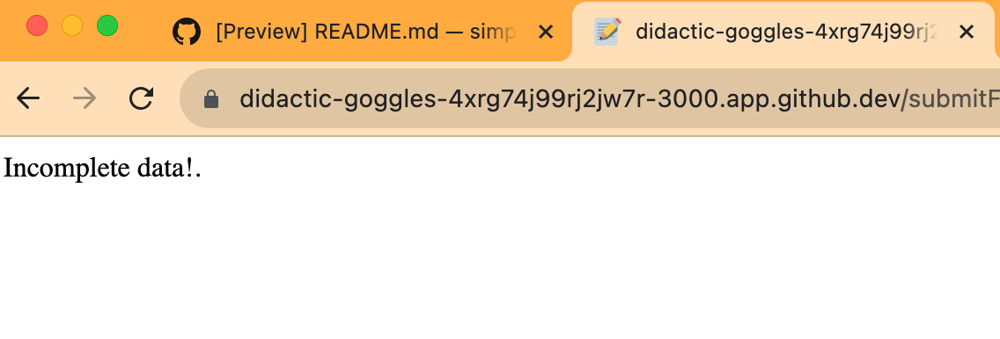
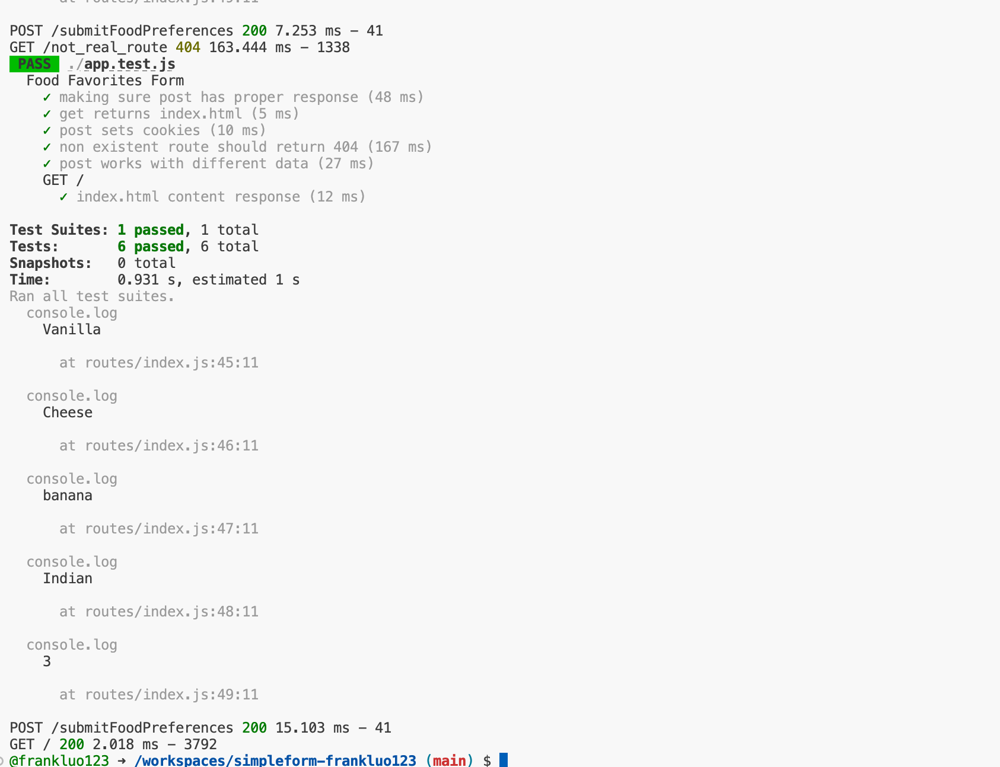
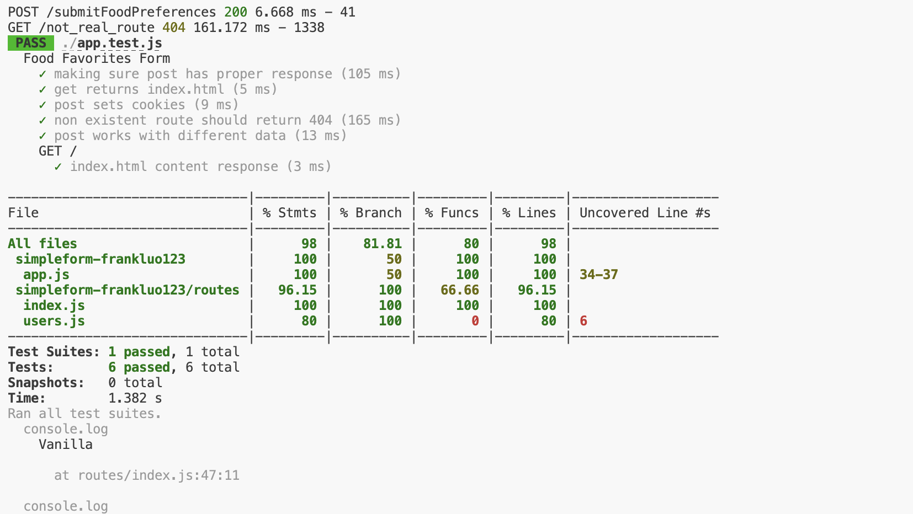
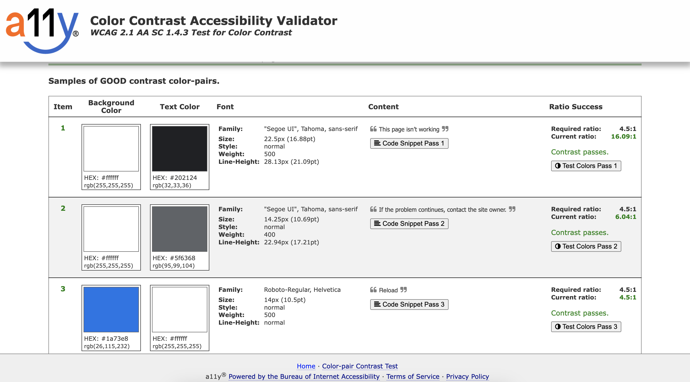

[](https://classroom.github.com/open-in-codespaces?assignment_repo_id=12296504)
# SimpleForm 📝✒️📋🖊️📃✏️🧾✍️

You will utilize Express to create a simple web form that saves data server-side

## Part 1 - Instructions

You will have to create this program from scratch.

0. Have `express` and `express-generator` installed. See [mozilla tutorial](https://developer.mozilla.org/en-US/docs/Learn/Server-side/Express_Nodejs/development_environment).
1. Run `express` followed by `npm install`.
2. Open the views folder and remove the `.jade` files (we'll use jade/pug in another assignment).
3. Create an `index.html` page with metadata like in other homeworks in the [public](public) folder. Also include a form (yes we're using a form now). The form needs to contain at least five input (5) elements like text fields, number input, drop-downs, radio buttons etc. The information you want to ask from the user is completely up to you. Here is an example to get you started (do not submit this example):

    ```html
    <div id="myform">
        <h1>Personality Quiz</h1>
        <form action="/myaction" method="post">
            <fieldset>
                <label for="color">Favorite Color:</label>
                <input type="text" id="color" name="color" />
                <label for="mynumber">Favorite Number:</label>
                <input type="number" id="mynumber" name="mynumber"/>
                <input type="submit" value="Complete Quiz" /> 
            </fieldset>
        </form>
    </div>
    ```

    Run the app by using the command `npm start`. You can view the page by visiting [localhost:3000](http://localhost:3000). Try clicking on the submit button at this point and see what happens.

4. Move the [favicon.ico](favicon.ico) file to the public folder then add the following to the index head:

    ```html
    <link rel="shortcut icon" href="favicon.ico" type="image/x-icon">
    ```

    This will add that icon to the browser tab and stop the messages about not being able to find the favicon. Feel free to change this icon.

5. Add some style to your index using CSS. Feel free to visit [http://www.oswd.org/](http://www.oswd.org/) for inspiration, but also cite and attribute any design you use that is not your own.
6. Update [routes/index.js](routes/index.js) to add a post handler. Your code should send a message that is dependent on the input to the post. For example, if the form involved converting temperatues, when the user typed 32 and checked the box for converting to Celcius, then the response should contain 0. Here is some code to get you started:

    ```javascript
    router.post('/myaction', (req, res, next) => {
    console.log(req.body.color);
    console.log(req.body.mynumber);
    res.send("Your personality says you like pizza.");
    });
    ```

    Note that whenever an expected element is missing, the post should write a 422 error code to the header.

7. After successfully implementing post, make it so that the post also responds with a cookie. This cookie will be saved client-side and should include the results of your computation. Here is an example to get you started:

    ```javascript
    console.log(req.body.color);
    console.log(req.body.mynumber);
    res.cookie('bestcookie', 'samoas', { maxAge: 900000, httpOnly: false});
    res.send("Post processed");
    ```

    Then alter [index.html](index.html) to read the cookie when it loads. This will allow for some persistance of data. Don't forget to style this `div` as well.

    ```html
    <div id="cookie"></div>
    <script>
        const cookies = document.cookie.split(';');
        console.log(cookies);
        for(let i = 0; i < cookies.length; i++){
            const split = cookies[i].split('=');
            if(split[0].trim() == "bestcookie"){
                document.getElementById("cookie").innerHTML=split[1];
                break;
            }
        }
    </script>
    ```

    This example code should be included inside the html, rather than a seperate JavaScript program, so that you do not have to test it (just for this assignment).

8. Add a Jest unit test file called [app.test.js](app.test.js) to ensure that your routing works as expected. Here is an example to get you started.

    ```javascript
    const request = require("supertest");
    const app = require("./app");

    describe("passing data", () => {
        test("post has proper response", async () => {
            let data = { 
                color: "green", 
                mynumber: 7
            };
            await request(app).post("/myaction").send(data).expect(200);
            data.color = undefined;
            await request(app).post("/myaction").send(data).expect(422);
        });
    });
    ```

    Also update [package.json](package.json) to include the proper dependencies.

9. Customize your form to ask the user for absolutely anything but remember, the form needs to contain at least five input (5) elements like text fields, number input, drop-downs, radio buttons etc. Again, the information you want to ask from the user is completely up to you. When ready, deploy your code to Codespaces.

Be sure that you have:

* Validated your HTML using [validator.w3.org](https://validator.w3.org/) to ensure no errors nor warnings. You might want to copy/paste the code instead of the website because Codespaces may impact things.
* Finished the [routes/index.js](routes/index.js) file to perform the necessary functions.
* Modified the documentation in the program's comments (for the files you edited) to describe the changes you made. Verify that you are well documenting your code using [JSDoc](https://www.npmjs.com/package/jsdoc) standards. You do not need to generate an API.
* Ensured that you write satisfactory unit tests and that your code passes them, with **75%** coverage, but the code you wrote needs to be completely covered.
* Test your color contrast by visiting [a11y.com](https://color.a11y.com/).

## Part 2 - Reflection

Add screenshots below showing,

* Your app running on Codespaces
* Your html validation
* Your code coverage
* Your color contrast test











Update the README to answer the following questions:

 1. Add a link to your website.

    (Have to type 'npm start' for website to work)
    https://didactic-goggles-4xrg74j99rj2jw7r-3000.app.github.dev/ 
    
 2. When should you use `post` instead of `get`? When should you use `get` instead of `post`?
    
    Both POST And GET are HTML methods that have distinct characteristics. GET is used for data retrieval operations where no side effects on the server are intended. POST is used to submit data to the server for processing, especially if the data is sensitive or large in volume. Is it important to note that GET is idempotent: Making the same GET request multiple times produces the same result with no side-effects. However, POST is not indempotent: Making the same POST request multiple times may result in different outcomes or side-effects.


 3. Define `web cookie` in your own words. Cite at least two sources you used when creating your definition.
    
    A web cookie is a small piece of data that a website sends to a user's web browser while they are browsing. Web cookies help websites remember information about the user, and thus they play a crucial role in enhancing user web experience.

    Sources: 

    https://developer.mozilla.org/en-US/docs/Web/HTTP/Cookies

    https://www.w3schools.com/js/js_cookies.asp 

 4. For many applications, html web storage objects (local storage and session storage) are recommended instead of cookies [w3schools](https://www.w3schools.com/html/html5_webstorage.asp). Summarize what these objects are and then explain why they were not used for this application.

    HTML web storage objects provide a way for web pages to store key-value pairs in a web browser that allows a much higher storage limit compared to cookies. They were not used in this application because a higher storage limit was not needed, and they are much more difficult to work with compared to cookies. Cookies provided us a much simpler server-side demonstration.


 5. Lookup the [express-validator](https://express-validator.github.io/docs/) middleware. Why is it a good idea to validate and sanitize data from the user using a package like this?

    It is a good idea to validate and sanitize data from the user to ensure data integrity, security, and proper application functioning. This express-validator package can provide protection from attacks, reduces server errors, and allows for data integrity. 

 ---

## Running Tests Locally

Packages used for testing:

* `jest`
* `supertest` [link](https://www.npmjs.com/package/supertest)

All of these packages should theoretically (🤞) be installed with the following command:

```bash
sudo npm install -g --save-dev jest supertest
```

Afterwards it is somtimes necessary to run the command:

```bash
npm install
```

Run the server by using the command

```bash
node server.js
```

Then hypothetically the tests *should* run with the command:

```bash
npm test
```

or

```bash
jest --runInBand --detectOpenHandles --coverage
```
